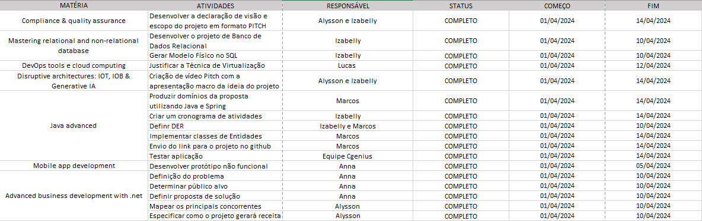
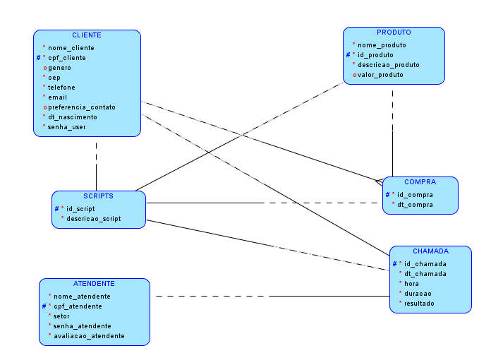

# CGeniuns

# Cronograma



# Diagrama de Entidade e Relacionamento (DER)



# Diagrama das Classes e Métodos


## Endpoints

### Cliente

`GET` /cliente

Lista todos os clientes cadastrados no sistema.

`200` sucesso

---

`GET` /cliente/{id}

Retorna os detalhes de um cliente com o `id` informado.

`GET` /cliente/cpf/{cpf}

Retorna os detalhes de um cliente com o `cpf` informado.

**códigos de status**

`200` sucesso 

`404` id/cpf não encontrado

---
`POST` /cliente

Cadastrar um novo cliente.

| campo | tipo | obrigatório | descrição
|-------|------|:-------------:|-----------
|nome_cliente|string|✅|O nome do cliente para ser cadastrado
|cpf_cliente|string|✅|O CPF do cliente para ser cadastrado
|genero|string|❌|O genero do cliente para ser cadastrado
|cep|string|✅|O cep do cliente para ser cadastrado
|telefone|string|✅|O telefone do cliente para ser cadastrado
|email|String|✅|O email do cliente para ser cadastrado
|preferencia_contato|String|❌|A Preferência de contato do cliente para ser cadastrado(ex. Manhã)
|dtNascimento|LocalDate|✅|A data de nascimento do cliente para ser cadastrado
|senha_user|string|✅|A senha do cliente para ser cadastrado


**códigos de status**

`201` criado com sucesso

`400` validação falhou

---

`DELETE` /cliente/{id} 

Apaga a cliente com o `id` informado.

`DELETE` /cliente/cpf/{cpf} 

Apaga a cliente com o `cpf` informado.

**códigos de status**

`204` apagado com sucesso
`404` id/cpf não encontrado

---

`PUT` /cliente/{id}
`PUT` /cliente/cpf/{cpf} 

Altera o cliente com o `id` ou `cpf` informado.

| campo | tipo | obrigatório | descrição
|-------|------|:-------------:|-----------
|nome_cliente|string|✅|O nome do cliente para ser cadastrado
|cpf_cliente|string|✅|O CPF do cliente para ser cadastrado
|genero|string|❌|O genero do cliente para ser cadastrado
|cep|string|✅|O cep do cliente para ser cadastrado
|telefone|string|✅|O telefone do cliente para ser cadastrado
|email|String|✅|O email do cliente para ser cadastrado
|preferencia_contato|String|❌|A Preferência de contato do cliente para ser cadastrado(ex. Manhã)
|dtNascimento|LocalDate|✅|A data de nascimento do cliente para ser cadastrado
|senha_user|string|✅|A senha do cliente para ser cadastrado

**códigos de status**

`200` sucesso
`404` id/cpf não encontrado
`400` validação falhou

---

**Schema**

```js
{
    "nome_cliente":"Antonio",
    "cpf_cliente":"12345678910",
    "genero": "masculino",
    "cep": "12345678",
    "telefone": "912345678",
    "email": "teste@gmail.com",
    "preferencia_contato": "Manhã",
    "dtNascimento": "2020-02-03",
    "senha_user": "123456"
}
```

### Atendente

`GET` /atendente

Lista todos os atendentes cadastrados no sistema.

`200` sucesso

---

`GET` /atendente/{id}

Retorna os detalhes de um atendente com o `id` informado.

`GET` /atendente/cpf/{cpf}

Retorna os detalhes de um atendente com o `cpf` informado.

**códigos de status**

`200` sucesso
`404` id/cpf não encontrado

---
`POST` /atendente

Cadastrar um novo atendente.

| campo | tipo | obrigatório | descrição
|-------|------|:-------------:|-----------
|nome_atendente|string|✅|O nome do atendente para ser cadastrado
|cpf_atendente|string|✅||O CPF do atendente para ser cadastrado
|setor|string|✅||O setor do atendente para ser cadastrado
|senha_atendente|string|✅||A senha do atendente para ser cadastrado
|avaliacao_atendente|integer|✅||A avaliação do atendente para ser cadastrado(ex. 0 = ruim, 5 = bom)


**códigos de status**

`201` criado com sucesso
`400` validação falhou

---

`DELETE` /atendente/{id} 

Apaga a atendente com o `id` informado.

`DELETE` /atendente/cpf/{cpf} 

Apaga a atendente com o `cpf` informado.

**códigos de status**

`204` apagado com sucesso
`404` id/cpf não encontrado

---

`PUT` /atendente/{id}
`PUT` /atendente/cpf/{cpf} 

Altera o atendente com o `id` ou `cpf` informado.

| campo | tipo | obrigatório | descrição
|-------|------|:-------------:|-----------
|nome_atendente|string|✅|O nome do atendente para ser cadastrado
|cpf_atendente|string|✅||O CPF do atendente para ser cadastrado
|setor|string|✅||O setor do atendente para ser cadastrado
|senha_atendente|string|✅||A senha do atendente para ser cadastrado
|avaliacao_atendente|integer|✅||A avaliação do atendente para ser cadastrado(ex. 0 = ruim, 5 = bom)

**códigos de status**

`200` sucesso
`404` id/cpf não encontrado
`400` validação falhou

---

**Schema**

```js
{
    "nome_atendente":"João",
    "cpf_atendente":"32165498710",
    "setor": "vendas",
    "senha_atendente": "654321",
    "avaliacao_atendente" : 4
}
```

### Chamada

`GET` /chamada

Lista todos os chamadas cadastrados no sistema.

`200` sucesso

---

`GET` /chamada/{id}

Retorna os detalhes de um chamada com o `id` informado.

**códigos de status**

`200` sucesso
`404` id não encontrado

---
`POST` /chamada

Cadastrar uma nova chamada.

| campo | tipo | obrigatório | descrição
|-------|------|:-------------:|-----------
|dt_chamada|LocalDate|✅|A data da chamada para ser cadastrado
|hora|LocalTime|✅|A hora da chamada para ser cadastrado
|duracao|LocalTime|✅|A duracao da chamada para ser cadastrado
|resultado|Boolean|✅|A resultado da chamada para ser cadastrado
|cpf_cliente|String|✅|O CPF do cliente da chamada para ser cadastrado
|cpf_atendente|String|✅|O CPF do atendente da chamada para ser cadastrado

**códigos de status**

`201` criado com sucesso
`400` validação falhou

---

`DELETE` /chamada/{id} 

Apaga a chamada com o `id` informado.

**códigos de status**

`204` apagado com sucesso
`404` id não encontrado

---

`PUT` /chamada/{id}

Altera o chamada com o `id` informado.

| campo | tipo | obrigatório | descrição
|-------|------|:-------------:|-----------
|dt_chamada|LocalDate|✅|A data da chamada para ser cadastrado
|hora|LocalTime|✅|A hora da chamada para ser cadastrado
|duracao|LocalTime|✅|A duracao da chamada para ser cadastrado
|resultado|Boolean|✅|A resultado da chamada para ser cadastrado
|cpf_cliente|String|✅|O CPF do cliente da chamada para ser cadastrado
|cpf_atendente|String|✅|O CPF do atendente da chamada para ser cadastrado

**códigos de status**

`200` sucesso
`404` id não encontrado
`400` validação falhou

---

**Schema**
```js
{
    "dt_chamada": "2020-01-05",
    "hora": "10:15:30",
    "duracao": "00:05:30",
    "resultado": "true",
    "cpf_cliente": "12345678910",
    "cpf_atendente": "32165498710"
}
```

### Produto
`GET` /produto

Lista todos os produtos cadastrados no sistema.

`200` sucesso

---

`GET` /produto/{id}

Retorna os detalhes de um produto com o `id` informado.

**códigos de status**

`200` sucesso
`404` id não encontrado

---
`POST` /produto

Cadastrar uma nova produto.

| campo | tipo | obrigatório | descrição
|-------|------|:-------------:|-----------
|descricao_produto|string|✅|A descrição do produto para ser cadastrado
|nome_produto|string|✅|O nome do produto para ser cadastrado
|valor_produto|BigDecimal|❌|O valor do produto para ser cadastrado

**códigos de status**

`201` criado com sucesso
`400` validação falhou

---

`DELETE` /produto/{id} 

Apaga a produto com o `id` informado.

**códigos de status**

`204` apagado com sucesso
`404` id não encontrado

---

`PUT` /produto/{id}

Altera o produto com o `id` informado.

| campo | tipo | obrigatório | descrição
|-------|------|:-------------:|-----------
|descricao_produto|string|✅|A descrição do produto para ser cadastrado
|nome_produto|string|✅|O nome do produto para ser cadastrado
|valor_produto|BigDecimal|❌|O valor do produto para ser cadastrado

**códigos de status**

`200` sucesso
`404` id não encontrado
`400` validação falhou

---

**Schema**
```js
{
    "descricao_produto": "Descrição do Produto X",
    "nome_produto": "produto X",
    "valor_produto": "123.45"
}
```

### Histórico
`GET` /historico

Lista todos os historicos cadastrados no sistema.

`200` sucesso

---

`GET` /historico/{id}

Retorna os detalhes de um historico com o `id` informado.

**códigos de status**

`200` sucesso
`404` id não encontrado

---
`POST` /historico

Cadastrar uma nova historico.

| campo | tipo | obrigatório | descrição
|-------|------|:-------------:|-----------
|idProduto|Long|✅|O ID do produto que será cadastrado
|cpfCliente|string|✅|O CPF do cliente que será cadastrado
|dtCompra|LocalDate|✅|A data da compra que será cadastrado

**códigos de status**

`201` criado com sucesso
`400` validação falhou

---

`DELETE` /historico/{id} 

Apaga a historico com o `id` informado.

**códigos de status**

`204` apagado com sucesso
`404` id não encontrado

---

`PUT` /historico/{id}

Altera o historico com o `id` informado.

| campo | tipo | obrigatório | descrição
|-------|------|:-------------:|-----------
|idProduto|Long|✅|O ID do produto que será cadastrado
|cpfCliente|string|✅|O CPF do cliente que será cadastrado
|dtCompra|LocalDate|✅|A data da compra que será cadastrado

**códigos de status**

`200` sucesso
`404` id não encontrado
`400` validação falhou

---

**Schema**
```js
{
    "idProduto": "1" ,
    "cpfCliente": "12345678910" ,
    "dtCompra": "2020-01-05" 
}
```

### Script
`GET` /script

Lista todos os scripts cadastrados no sistema.

`200` sucesso

---

`GET` /script/{id}

Retorna os detalhes de um script com o `id` informado.

**códigos de status**

`200` sucesso
`404` id não encontrado

---
`POST` /script

Cadastrar uma nova script.

| campo | tipo | obrigatório | descrição
|-------|------|:-------------:|-----------
|id_compra|Long|✅|O ID da compra que será cadastrado
|id_produto|Long|✅|O ID do produto que será cadastrado
|id_chamada|Long|✅|O ID da chamada que será cadastrado
|cpf_cliente|String|✅|O CPF do cliente que será cadastrado
|descricao_script|Long|✅|A descrição do script que será cadastrado

**códigos de status**

`201` criado com sucesso
`400` validação falhou

---

`DELETE` /script/{id} 

Apaga a script com o `id` informado.

**códigos de status**

`204` apagado com sucesso
`404` id não encontrado

---

`PUT` /script/{id}

Altera o script com o `id` informado.

| campo | tipo | obrigatório | descrição
|-------|------|:-------------:|-----------
|id_compra|Long|✅|O ID da compra que será cadastrado
|id_produto|Long|✅|O ID do produto que será cadastrado
|id_chamada|Long|✅|O ID da chamada que será cadastrado
|cpf_cliente|String|✅|O CPF do cliente que será cadastrado
|descricao_script|Long|✅|A descrição do script que será cadastrado

**códigos de status**

`200` sucesso
`404` id não encontrado
`400` validação falhou

---

**Schema**
```js
{
    "id_compra": "1",
    "id_produto": "1",
    "id_chamada": "1",
    "cpf_cliente": "12345678910",
    "descricao_script" : "Descrição do Script"
}
```
